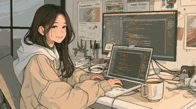

<!-- Header -->

  

  

<!-- Hero -->

<h1 align="center">
  
</h1>

  💻 <b>Developer</b> • 🧠 <b>Builder</b> • ✨ <b>Hackathon Energy</b> • ☕ <b>Cozy Coder</b>

  

  <b>
    I love turning ideas into working products — from cozy side projects to shipping under pressure.
  </b>

---

## 🌷 About Me

* 👩‍💻 Love building things — from cozy side projects to shipping under hackathon pressure
* 🧠 Curious about **full-stack development**, **AI**, and turning ideas into working products
* ☕ Always coding with a warm drink nearby and a long to-do list
* 🌱 Currently leveling up and exploring new tools, stacks, and creative builds

  

---

## 🏆 Hackathons & Achievements

  <i>Fast builds, shipped ideas, and fun builder moments along the way.</i>

| 🎯 Event | 💡 Project | Description | 🌟 Achievement | 🔗 Links |
| :--- | :--- | :--- | :--- | :--- |
| _Coming soon_ | — | Add your hackathon wins here | — | — |

---

## 🎨 Tech Stack & Tools

  

---

## 🐍 Contributions

  <picture>
    <source media="(prefers-color-scheme: dark)" srcset="https://raw.githubusercontent.com/itzsihui/itzsihui/output/github-contribution-grid-snake-dark.svg" />
    <source media="(prefers-color-scheme: light)" srcset="https://raw.githubusercontent.com/itzsihui/itzsihui/output/github-contribution-grid-snake.svg" />
    
  </picture>

---

  <b>Thanks for stopping by — let's build something cool together! ✨</b>

<!-- Footer -->

  

